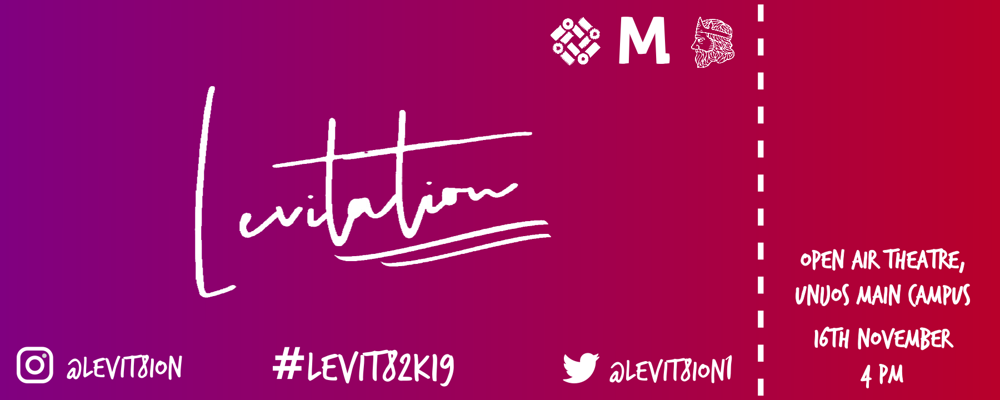
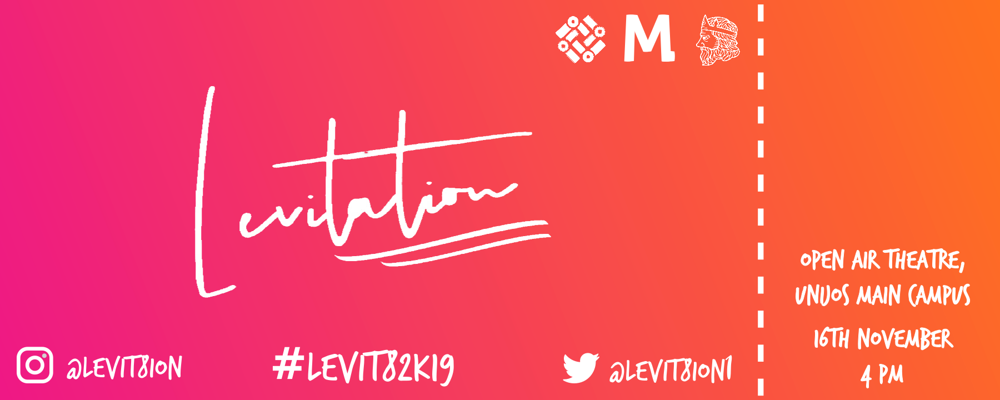
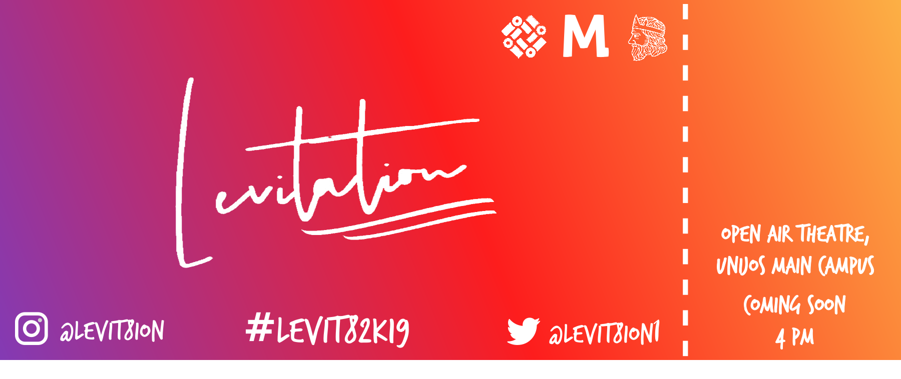

# Levitation Ticket Generator

## About
This repository houses the CLI utilities which I used to generate tickets for the [Levitation 2018 Music Concert](https://levitationconcert.xyz). Each generated ticket has a unique QR code to uniquely identify each attendee.

## Requirements
* [Nodejs](https://nodejs.org/en/download/)
* Run `npm install` to download and install the required dependencies; Jimp and QRCode

## Usage
1. `index.js` - This script generates the tickets by generating a QR code image then compositing it on the base ticket image.
    - Running this command will generate tickets and put them in the `tickets` directory
    - The `ticketCount` argument tells the program the number of tickets to generate. The default value is **5**
    - The `clear` argument tells the program to delete any tickets that had previously been generated that are still in the `tickets` directory
    
         ```$ node index.js [ticketCount=5] [clear]```
    

2. `generateHTML.js` - This script builds a HTML which has all the tickets. After this HTML file is generated, open it up in Google Chrome or Safari then save it as a PDF.
    - Running this command will generate a HTML file and put it in the `tickets` directory
    - The `pages` argument tells the program the number of pages of tickets to generate. The default value is **1**
    - The `clear` argument tells the program to delete any tickets that had previously been generated that are still in the `tickets` directory
    
         ```$ node generateHTML.js [pages=1] [clear]```

## Ticket formats

---

---

---

